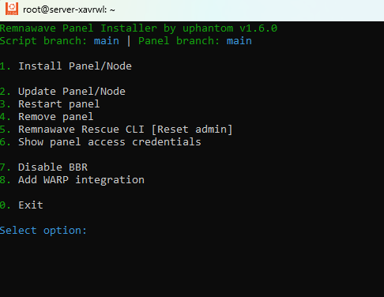

[🇷🇺 Читать на русском](README.ru.md)

## Remnawave Installer

This script is designed for automated installation of **Remnawave** panel and node.

**IMPORTANT!** DO NOT USE THE PANEL IN PRODUCTION without full understanding of how everything works!!!

This script is intended only for demonstrating Remnawave functionality!

You can use Remnawave in two ways:

- **Option 1 (Two servers)**: Install panel and node on different servers (recommended)
- **Option 2 (All-in-one)**: Install panel and node on one server (simplified installation)

### Option 1: Two servers

For full functionality, you will need two separate fresh servers running Ubuntu 22.04:

- Panel server - it will be the control center but will not contain the Xray node
- Node server - it will contain the Remnawave node and Self Steal fallback for VLESS REALITY

You will need three domains (subdomains): one for the panel, second for subscriptions, and third for the Self Steal fallback site, which is hosted on the node server.

**Important about DNS configuration:**

- Panel and subscription domains must point to the panel server's IP address
- Self Steal fallback site domain must point to the node server's IP address

Recommended installation order:

1. First install the panel and obtain the public key for your node.
2. Then install the node, specifying the previously obtained key.

### Option 2: All-in-one

In this option, you can deploy both panel and node on one server, which reduces reliability but doesn't require 2 servers.

This option automatically configures interaction between panel and node, simplifying the installation and management process.

In this configuration, Remnawave node (Xray inside it) handles all incoming traffic on port 443. All requests that are not Xray proxy connections go to dest fallback and are redirected to Caddy, which then distributes them to the appropriate services (panel, selfsteal, subscriptions depending on SNI). If you stop the local Remnawave node in this mode, the panel will become inaccessible, in which case you need to select the menu option "Open direct access to panel - I broke Xray config/node".

```
Client → Port 443 → Xray → (Proxy connections)
                      ↓
                     Caddy → Panel/Subscriptions/Selfsteal (depending on SNI)
```

## System Requirements

- OS: Ubuntu 22.04, 2 GB RAM, 2 CPU Cores (less is possible but not recommended, especially for All-in-One installation with Caddy Auth)
- User with root privileges (sudo)

## Installation

To run the installer, execute the following command in terminal:

```bash
bash <(curl -Ls https://raw.githubusercontent.com/xxphantom/remnawave-installer/refs/heads/main/dist/install_remnawave.sh)
```

<p align="center"></p>

## Panel Protection Option Based on Cookie and URL Parameter

Additional protection against panel discovery has been added to Caddy:

- To access the panel, you need to open a page like:

  ```
  https://YOUR_PANEL_DOMAIN/auth/login?caddy=<SECRET_KEY>
  ```

- The parameter `?caddy=<SECRET_KEY>` sets a special cookie `caddy=<SECRET_KEY>` in the browser.
- If the cookie is not set or the parameter is missing from the request, when accessing the panel the user will see a blank page or 404 error (depending on the requested path).

Thus, even if an attacker scans the host or tries different paths, without the exact parameter and/or cookie the panel will remain invisible.

## Panel Protection Option Based on Caddy Auth (recommended)

Caddy Auth is a comprehensive authentication and authorization system that provides maximum security level for the Remnawave panel.

### Security Architecture

When using FULL Caddy Security, a two-level protection system is created:

1. **First level - Caddy Auth Portal**: User first authenticates in Caddy Auth
2. **Second level - Remnawave Panel**: After successful authentication in Caddy Auth, user gains access to Remnawave panel

### Key Features

#### Multi-Factor Authentication (MFA)

- **Mandatory MFA setup**: System requires two-factor authentication configuration
- **TOTP support**: Compatible with Google Authenticator, Authy, Microsoft Authenticator and other apps
- **Security**: Even if password is compromised, access remains protected

#### Secure Routes

- **Random paths**: Automatic generation of unique paths for panel access
- **Panel hiding**: Panel is inaccessible via standard paths
- **Scan protection**: Makes panel discovery difficult for automated scanners

### Panel Access Process

1. **Navigate to secure URL**: `https://YOUR_DOMAIN/<RANDOM_PATH>/auth`
2. **Authenticate in Caddy Auth**: Enter login and password
3. **Confirm MFA**: Enter code from authenticator app
4. **Access panel**: Login to Remnawave with separate credentials

### Credentials

Two sets of credentials are created during installation:

#### Caddy Auth (first protection level)

- **Login**: Automatically generated
- **Password**: Complex password (25 characters)
- **Email**: Specified during installation
- **MFA**: Configured on first login

#### Remnawave Panel (second level)

- **Login**: Automatically generated SuperAdmin
- **Password**: Complex password (25 characters)

## Service Management

After installation, you can manage services using the `make` command in corresponding directories:

### For "Two servers" option:

- **Panel directory**: `/opt/remnawave`
- **Caddy directory**: `/opt/remnawave/caddy`
- **remnawave-subscription-page directory**: `/opt/remnawave/remnawave-subscription-page`

- **Node directory**: `/opt/remnanode/node`
- **Fallback site directory**: `/opt/remnanode/selfsteal`

### For "All-in-one" option:

- **Panel directory**: `/opt/remnawave`
- **Caddy directory**: `/opt/remnawave/caddy`
- **Node directory**: `/opt/remnawave/node`

Available commands:

- `make start` — Start and view logs
- `make stop` — Stop
- `make restart` — Restart
- `make logs` — View logs

## Notes

- Ensure you have DNS records configured for **all** specified domains, pointing to the corresponding server's IP address.
- When using "All-in-one" option, one domain is used for all services (panel, subscriptions, Self Steal).
